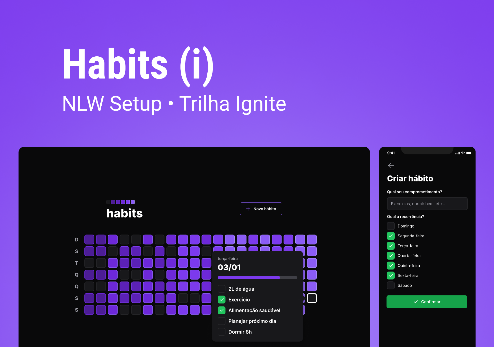

<h2 align="center"></h2>


<br>

### 🔖 Layout
Para visualizar o layout click aqui: [Layout](<https://www.figma.com/community/file/1195326661124171197>)
- Lembrete: Você precisa ter uma conta no [Figma](http://figma.com/) para acessar.

<br>

### 🪄 Tecnologias utilizadas:

#### frontend:

- [ViteJS](https://vitejs.dev/)
- [ReactJS](https://reactjs.org/)
- [TypeScript](https://www.typescriptlang.org/)
- [TailwindCSS](https://tailwindcss.com/)
- [dayjs](https://github.com/iamkun/dayjs/)
- [Radix](https://www.radix-ui.com/)
- [clsx](https://www.npmjs.com/package/clsx)
- [phosphor](https://phosphoricons.com/)
- [axios](https://axios-http.com/docs/intro)
- [postman](https://www.postman.com/)
- [vscode](https://code.visualstudio.com/)


#### backend: 
- [NodeJS](https://nodejs.org/)
- [TypeScript](https://www.typescriptlang.org/)
- [Fastify](https://www.fastify.io/)
- [Prisma](https://www.prisma.io/)
- [SQLite ](https://www.sqlite.org/index.html)
- [zod ](https://www.npmjs.com/package/zod)
- [dayjs  ](https://github.com/iamkun/dayjs/)
- [uuid ](https://www.uuidgenerator.net/)
- [postman](https://www.postman.com/)
- [vscode](https://code.visualstudio.com/)


#### mobile:

- [React Native](https://reactnative.dev/)
- [Expo](https://expo.io/)
- [TypeScript](https://www.typescriptlang.org/)
- [axios](https://axios-http.com/docs/intro)
- [clsx](https://www.npmjs.com/package/clsx)
- [TailwindCSS](https://tailwindcss.com/)
- [dayjs  ](https://github.com/iamkun/dayjs/)
- [postman](https://www.postman.com/)
- [vscode](https://code.visualstudio.com/)


<br>

### 🚀 Como rodar
```bash
$ Observação: Para testar precisa server e web estarem rodando juntos, assim como server e mobile.
```
#### Web

```bash
# Instalar dependencias
$ cd web
$ npm install

# Executar o projeto
$ npm run dev
```

#### Server

```bash
# Instalar dependencias
$ cd server
$ npm install

# Executar o projeto
$ npx prisma migrate deploy
$ npm run dev
$ npx prisma studio

$ Para visualizar o diagrama das tabelas em seu navegador abra a pasta server/prisma/ERD.svg
Clique botão direiro → Open live server → abrirá no navegador
```

#### Mobile

```bash
# Instalar dependencias
$ cd mobile
$ npm install

# Executar o projeto
$ npx expo start

$ Observação: dentro da pasta mobile/lib, crie o arquivo axios.ts 
`
import axios from "axios";

export const api = axios.create({
  baseURL: 'http://000.000.000.0:3333'
})
`
* Precisa adicionar o seu IP na 'baseURL:http://000.000.000.0:3333' estará disponivel  abaixo do QR code ao executar o projeto *
```
<br>

#### Testar requisições HTTP

```bash
# Instale o postman 
(https://www.postman.com/)

# Faça as requisições:
GET: http://localhost:3333/day?date=2023-01-25T23:25 
* Coloque data atual na requisição *

PATCH: http://localhost:3333/habits/3ecf23fd-d401-4573-8cb9-5950db0b04cf/toggle
* Copie o id da requisição gerada GET acima *

POST: http://localhost:3333/habits
    body: {
    "title":"Exemplo de habito",
    "weekDays":[0,1,2]
}

GET: http://localhost:3333/summary
```
<br>
